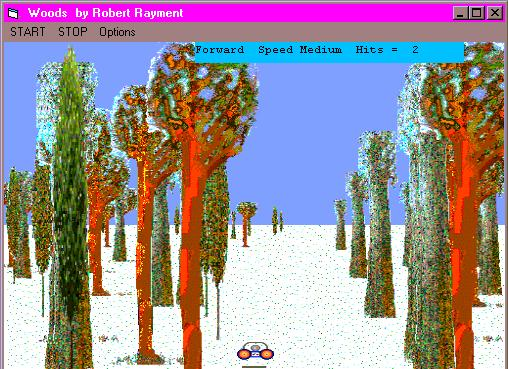



## A Dash Thru the Woods

### Description

A Dash Through the Woods by Robert Rayment.  UPDATE: Improved bitmap creation (Having been goaded by Paul) plus some simple sound. This prog is based on the triplet StretchDIBits, byte arrays and assembler (as with 'Tunnels & Things' which got 10 excellent votes) except I've left out the assembler which means that it MUST be compiled so that the array manipulations are again dealt with by machine code. The prog will only produce a large bitmap file of smaller trees from a starting bitmap ONCE so that later runs can load up the byte arrays quickly. The creation of the bit maps is fast enough now so you could leave out the save to disk if you wanted to. It shows some other uses for StretchDIBits and 8-bit color byte surfaces, which might be of interest to some of you. No assembler is used.  Trees are then put onto a drawing surface starting with the smallest and ignoring a white surround (masks not needed). By keeping and adjusting the x-position, direction and type of tree it looks like moving through some woods. Timing (using GetTickCount) and hence speed, the number of tree starts and their spread are on an options menu. The left & right cursor moves a little car to the left & right (actually the trees move in the opposite direction) and the up & down cursor changes the speed. You have to try not to hit the trees. Collision detection is based on x-coords. It needs compiling to an EXE to get a decent speed. Don't expect DirectX quality but I think its fun! The Zip file is 54 KB.
 
### More Info
 
Nothing special

Game

Produces a binary bitmap file once

             |
---                |---
**Submitted On**   |2001-03-15 06:26:04
**By**             |[Robert Rayment](https://github.com/Planet-Source-Code/PSCIndex/blob/master/ByAuthor/robert-rayment.md)
**Level**          |Intermediate
**User Rating**    |4.7 (28 globes from 6 users)
**Compatibility**  |VB 6\.0
**Category**       |[Graphics](https://github.com/Planet-Source-Code/PSCIndex/blob/master/ByCategory/graphics__1-46.md)
**World**          |[Visual Basic](https://github.com/Planet-Source-Code/PSCIndex/blob/master/ByWorld/visual-basic.md)
**Archive File**   |[CODE\_UPLOAD170863152001\.zip](https://github.com/Planet-Source-Code/robert-rayment-a-dash-thru-the-woods__1-21486/archive/master.zip)

### API Declarations

StretchDIBits plus a couple

